**Corporate Credit Rating Model – Code Walkthrough**

**1. Introduction**

This document provides a detailed, function‑by‑function walkthrough of
the credit rating engine, explaining each configuration element, helper
function, data class, and model method in a structured and
implementation‑oriented manner.​

**2. Module Imports**

**2.1 Import statements**

**Signature (code)**

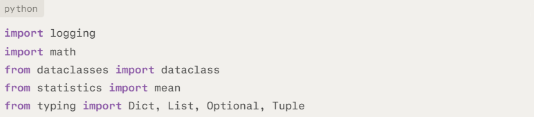

**Purpose**

Provides core Python functionality for logging model activity, handling
numeric operations, defining structured data containers, computing
averages, and annotating types in a clear and maintainable way.​

**Behavior (line by line)**

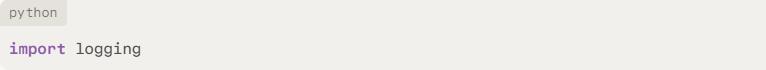

Imports the standard logging framework used to emit informational and
diagnostic messages during ratio scoring, distress checks, and final
rating computation.​

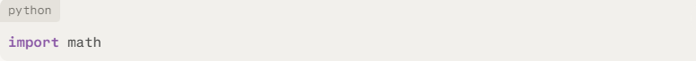

Imports mathematical utilities such as inf, nan, and floor, required for
ratio grids, NaN handling, and band‑based outlook logic.​


Imports the dataclass decorator, which is used to define compact, typed
containers (QuantInputs, QualInputs, RatingOutputs) with automatically
generated initialization and representation methods.​


Imports the mean function to compute arithmetic averages, for example
when deriving peer averages in compute_peer_score.​


Imports generic type hint classes that are used throughout the module to
describe mappings, sequences, and optional values in function signatures
and data classes.​

**Interpretation**

These imports establish a typed, logged, and numerically robust
environment for the rating engine, so that subsequent components can
rely on clear data structures, reproducible numeric behavior, and
traceable execution.

**3. Configuration**

The configuration section defines static mappings and parameters that
shape how financial ratios are grouped, scored, and ultimately
transformed into credit ratings.​

**3.1 RATIO_FAMILY**

**Signature (code)**

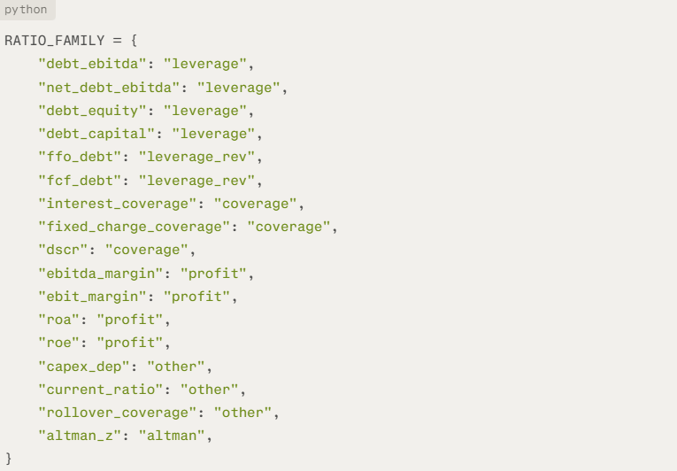

**Purpose**

Defines a classification scheme that assigns each financial ratio to
a **ratio family**, enabling grouped analysis (e.g. leverage vs
coverage) and family‑level diagnostics such as average scores per
category.​

**\**

**Behavior (mapping by category)**

**Ratios mapped to "leverage":**

- "debt_ebitda", "net_debt_ebitda", "debt_equity", "debt_capital"\
  These ratios measure indebtedness relative to earnings, equity, or
  total capital and form the core leverage block.​

**Ratios mapped to "leverage_rev":**

- "ffo_debt", "fcf_debt"\
  These use cash‑flow‑based denominators (funds from operations, free
  cash flow) and capture the ability to service or repay debt from
  internal cash generation.​

**Ratios mapped to "coverage":**

- "interest_coverage", "fixed_charge_coverage", "dscr"\
  These ratios focus on the capacity to cover interest and total debt
  service, and are key indicators in both distress logic and basic
  creditworthiness.​

**Ratios mapped to "profit":**

- "ebitda_margin", "ebit_margin", "roa", "roe"\
  These metrics reflect profitability and returns on assets or equity,
  informing the model about the strength and efficiency of the
  underlying business.​

**Ratios mapped to "other":**

- "capex_dep", "current_ratio", "rollover_coverage"\
  These cover capex sustainability, short‑term liquidity, and
  refinancing coverage, providing additional context beyond pure
  leverage and profitability.​

**Ratio mapped to "altman":**

- "altman_z"\
  This is the Altman Z‑score, treated as its own family due to its role
  as a composite distress indicator used directly in the hardstop logic.​

**Interpretation**

RATIO_FAMILY is used in the quantitative engine to allocate each ratio’s
subscore into a family‑specific bucket, from which **bucket
averages** are computed and stored in bucket_avgs; this supports
explanations such as “leverage is moderate, coverage is weak,
profitability is solid” rather than only reporting a single aggregate
score.

**3.2 SCORE_TO_RATING**

**Signature (code)**

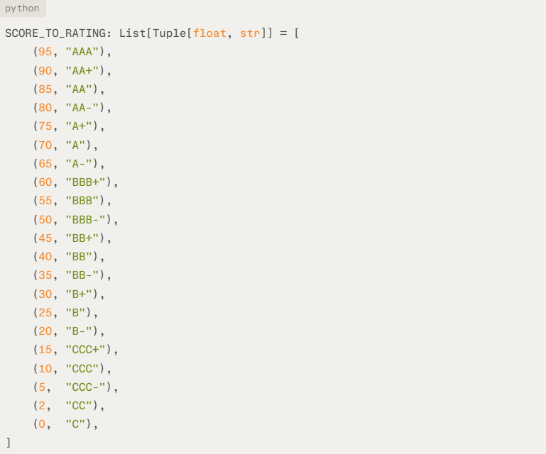

**Purpose**

Defines the **mapping from a 0–100 combined score to an external‑style
letter rating**, by specifying the minimum score required for each
rating grade.​

**Behavior**

The list is ordered from **highest** cutoff to **lowest**, so higher
ratings come first:

- Scores ≥ 95 map to "AAA".

<!-- -->

- Scores between 90 and 94 map to "AA+".

- Scores between 85 and 89 map to "AA", and so on down to "C" at 0.​

Each tuple (cutoff, grade) states that the rating grade applies whenever
the combined score is **at least** cutoff, assuming no higher cutoff has
already matched.

The helper function score_to_rating walks this list and returns the
first grade whose cutoff is less than or equal to the combined score,
implementing a step‑function from continuous scores to discrete rating
bands.​

**Interpretation**

SCORE_TO_RATING acts as the **bridge between the internal numeric scale
and the ordinal rating scale** used in credit practice. It allows the
model to explain clearly which score range corresponds to each rating
level and to adjust these thresholds if calibration or policy changes
are required.

**3.3 RATING_SCALE**

**Signature (code)**

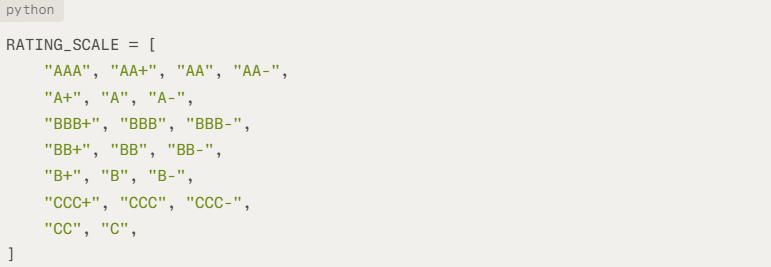

**Purpose**

Defines the **ordered ordinal rating scale** used by the model, from
strongest credit quality ("AAA") to weakest ("C"), and provides a common
reference for all notch‑based rating transitions.​

**Behavior**

The list entries represent all allowed long‑term rating symbols,
including plus and minus notches within each major category (AA, A, BBB,
BB, B, CCC, CC, C).

Ratings are ordered from best to worst, so lower indices correspond
to **stronger** credit quality and higher indices to **weaker** credit
quality.

Helper functions such as move_notches and apply_sovereign_cap:

- Convert ratings to indices via RATING_SCALE.index(grade).

- Move along the scale (upgrade/downgrade) by adding or subtracting from
  the index.

- Clamp moves to the range \[0, len (RATING_SCALE) - 1\] so ratings
  never go above "AAA" or below "C".​

**Interpretation**

RATING_SCALE serves as the **backbone for ordinal operations** on
ratings: it enables comparison of rating strength, implementation of
multi‑notch adjustments, and enforcement of the sovereign ceiling in a
consistent, transparent manner across the entire model.

**3.4 RATING_WEIGHTS**

**Signature (code)**

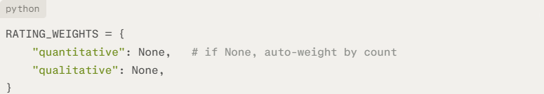

**Purpose**

Configures the relative weights of
the **quantitative** and **qualitative** modules in the combined score,
while allowing either explicit fixed weights or automatic, data‑driven
weights based on factor counts.​

**Behavior**

The dictionary has two keys:

- "quantitative": intended weight for the quantitative score.

- "qualitative": intended weight for the qualitative score.​

When both entries are set to concrete numbers (for example 0.7 and 0.3):

- compute_effective_weights returns these values directly as the
  effective weights.

When either entry is None:

- compute_effective_weights falls back to **automatic weighting**:

  - Counts the number of active quantitative factors (n_quant) and
    qualitative factors (n_qual).

  - Derives weights proportional to these counts:

    - $`w_{q} = \frac{n_{\text{quant}}}{n_{\text{quant}} + n_{\text{qual}}}`$

    - $`w_{l} = \frac{n_{\text{qual}}}{n_{\text{quant}} + n_{\text{qual}}}`$

  - If both counts are zero, defaults to (0.0, 0.0).​

**Interpretation**

RATING_WEIGHTS provides a flexible mechanism for combining quantitative
and qualitative information: it supports both **policy‑driven fixed
weights** and **adaptive weights** that reflect the relative richness of
available data, while always ensuring that the quantitative and
qualitative contributions sum to 100% of the combined score.​

**\**

**3.5 Distress configuration**

This group of constants configures when distress logic becomes active,
how many notches are applied at different weakness levels, and how far
the cumulative distress adjustment is allowed to go; these settings
underpin an ***optional*** hardstop that is only applied when
the enable_hardstops switch in compute_final_rating is set
to True (default False).

**3.5.1 DISTRESS_TRIGGERS**

**Signature (code)**

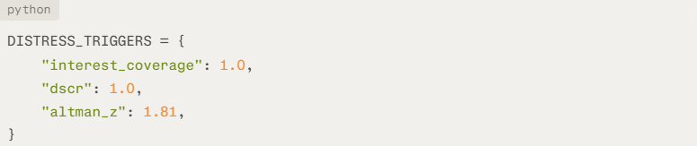

**Purpose**

Defines **trigger levels** for key distress ratios, i.e. the points
below which the ratios start to be considered indicative of financial
distress.​

**Behavior**

- interest_coverage: 1.0\
  Below this level, EBIT does not fully cover interest expense,
  signaling potential inability to service interest over time.​

- dscr: 1.0\
  Below this level, operating cash flow does not fully cover total debt
  service, indicating structural under coverage.​

- altman_z: 1.81\
  Values below 1.81 fall into the classic “grey/distress” zone in the
  Altman Z framework, associated with elevated bankruptcy risk.​

These triggers provide conceptual cut‑offs for when low values in these
ratios should be treated as distress; the concrete notch impacts are
defined by the distress bands.

**Interpretation**

DISTRESS_TRIGGERS express, in economic terms, where “normal” risk ends
and distress begins for each indicator, forming the qualitative boundary
between regular scoring and hardstop‑driven penalties.​

**3.5.2 DISTRESS_BANDS**

**Signature (code)**

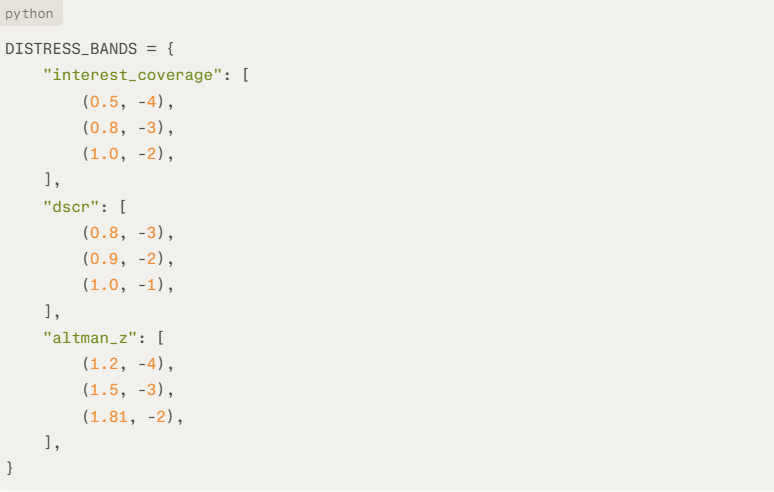

**Purpose**

Specifies **banded notch penalties** for each distress ratio, indicating
how many rating notches are subtracted as the ratio falls deeper into
distress zones.​

**Behavior**

For each ratio:

- interest_coverage bands:

  - \< 0.5 → -4 notches (very severe coverage shortfall).

  - \< 0.8 → -3 notches.

  - \< 1.0 → -2 notches (just below 1.0 trigger).​

- dscr bands:

  - \< 0.8 → -3 notches (deeper structural under coverage).

  - \< 0.9 → -2 notches.

  - \< 1.0 → -1 notch (just below 1.0 trigger).​

- altman_z bands:

  - \< 1.2 → -4 notches (deep distress).

  - \< 1.5 → -3 notches.

  - \< 1.81 → -2 notches (entry into the classic distress/grey zone).​

In compute_distress_notches:

> For each distress ratio, the model:

- Reads the current value.

- Iterates over the corresponding list of (threshold, notches) in order.

- On the **first** match where value \< threshold, adds
  that notches value (negative) to total_notches, records the ratio
  in details, and stops checking further bands for that ratio.​

**Interpretation**

DISTRESS_BANDS implement a graduated hard‑stop rule: the weaker the
distress indicator, the larger the enforced downgrade, regardless of how
optimistic the base model score might be. This prevents the model from
assigning high ratings when key distress metrics are very weak.

**3.5.3 MAX_DISTRESS_NOTCHES**

**Signature (code)**


**Purpose**

Introduces a lower bound on the **total distress‑driven notch impact**,
so that even if multiple distress bands are triggered, the cumulative
downgrade from distress logic cannot exceed a predefined maximum.​

**Behavior**

After summing contributions from interest coverage, DSCR, and Altman Z
in compute_distress_notches, the function checks:

- If total_notches \< MAX_DISTRESS_NOTCHES, it sets total_notches =
  MAX_DISTRESS_NOTCHES.

With MAX_DISTRESS_NOTCHES = -4, the distress block cannot impose more
than a four‑notch downgrade in total.​

**Interpretation**

MAX_DISTRESS_NOTCHES ensures that distress logic behaves as a **bounded
floor** rather than an unbounded penalty mechanism, providing a clear
policy limit on how far mechanical distress rules are allowed to move
the rating.

**3.6 RATIO_GRIDS**

**Signature (code)**

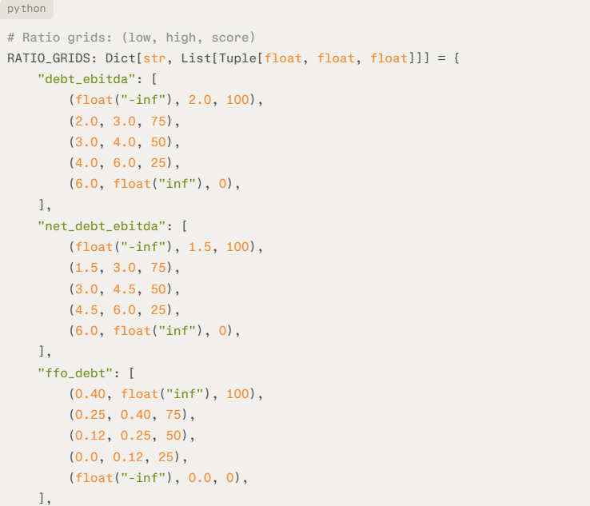

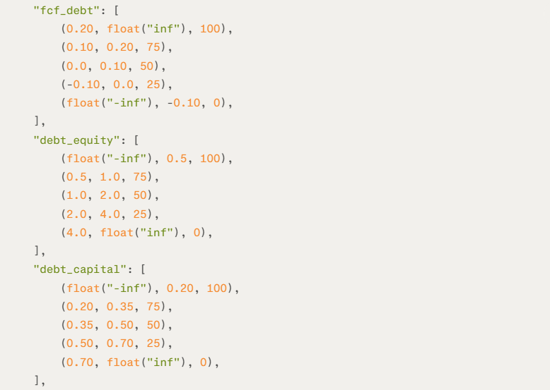


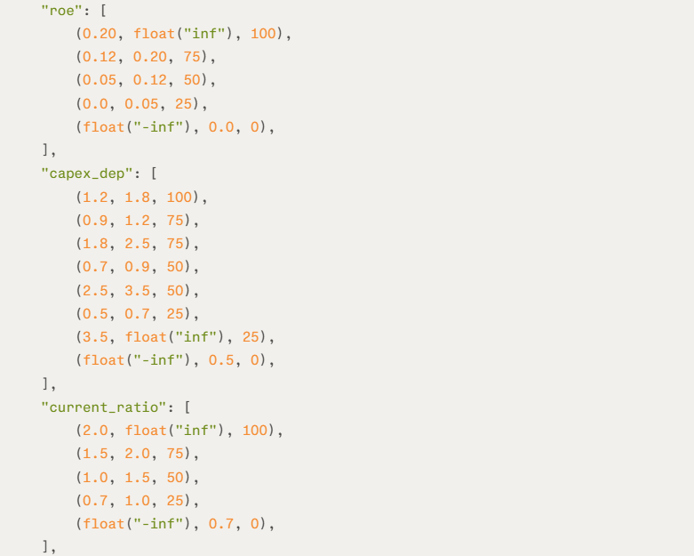

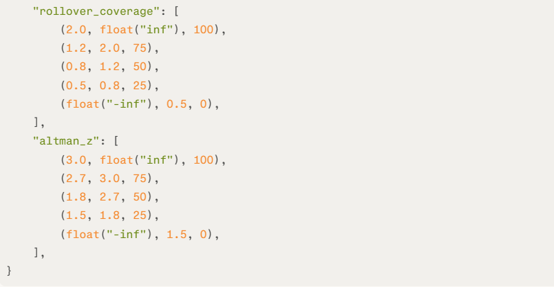

**Purpose**

Provides **piecewise scoring grids** for each financial ratio, mapping
raw ratio values into 0–100 sub scores based on which interval the value
falls into.​

**Behavior**

The type annotation Dict\[str, List\[Tuple\[float, float,
float\]\]\] indicates that:

- Each key is a ratio name (e.g. "debt_ebitda").

- Each value is a list of triples (low, high, score) representing a
  closed‑open interval $`\lbrack low,high)`$ and its associated
  subscore.​

The helper function score_ratio uses these grids as follows:

- Retrieves the list for the given ratio name.

- Iterates over the triples and returns score for the first band
  satisfying low \<= value \< high.

Returns None if no band matches or if the ratio has no configured grid.​

**Economic meaning by ratio group**

**Leverage
ratios** ("debt_ebitda", "net_debt_ebitda", "debt_equity", "debt_capital"):

- Lower leverage bands receive higher scores (e.g. debt_ebitda \<
  2.0 → 100), while high leverage bands receive progressively lower
  scores down to 0, reflecting stronger solvency at lower debt levels.

**Cash‑flow‑based leverage** ("ffo_debt", "fcf_debt"):

- Higher coverage of debt by FFO or FCF maps to 100, with scores
  decreasing as coverage weakens and turning to 0 for very low or
  negative coverage, capturing reduced repayment capacity.

**Coverage
ratios** ("interest_coverage", "fixed_charge_coverage", "dscr"):

- High coverage (e.g. interest coverage ≥ 8x, DSCR ≥ 2x) is scored 100.

- Coverage close to or below 1.0 falls into low bands with
  scores 25 or 0, consistent with elevated default risk when earnings or
  cash flow barely cover or fail to cover obligations.

**Profitability ratios** ("ebitda_margin", "ebit_margin", "roa", "roe"):

- Strong margins and returns (e.g. roa ≥ 12%, roe ≥ 20%) map to 100.

- Low or negative profitability maps progressively down to 0, reflecting
  weaker shock‑absorbing capacity and internal capital generation.

**Capex sustainability** ("capex_dep"):

- Bands around 1.2–1.8x depreciation receive 100, indicating balanced
  reinvestment.

- Moderate deviations (e.g. 0.9–1.2 or 1.8–2.5) receive 75, and more
  extreme values receive 50 or 25, while very low or very high values
  receive 0, capturing potential underinvestment or unsustainable
  overinvestment.

**Liquidity and refinancing** ("current_ratio", "rollover_coverage"):

- Strong liquidity or rollover coverage (e.g. ≥ 2.0) is scored 100.

- Weak liquidity (e.g. current_ratio \< 0.7) or low rollover coverage
  (e.g. \< 0.5) is scored 0, signaling elevated short‑term refinancing
  risk.

**Distress composite ("altman_z"):**

- Z‑scores ≥ 3.0 are scored 100 (classic “safe zone”).

- Scores in the 2.7–3.0 and 1.8–2.7 ranges are mapped to 75 and 50.

- Values below 1.5 receive 0, aligning with the standard distress zone
  in the Altman framework.

**Interpretation**

RATIO_GRIDS standardizes a heterogeneous set of financial ratios onto a
common **0–100 scale**, enabling simple aggregation into overall
quantitative scores and family‑level bucket averages. The use of
explicit numeric bands makes the scoring rules transparent and easy to
adjust or recalibrate over time.

**3.7 QUAL_SCORE_SCALE**

**Signature (code)**

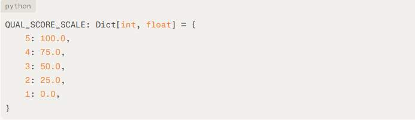

**Purpose**

Defines a linear mapping from 1–5 qualitative factor scores to a 0–100
numeric scale, so that qualitative assessments can be combined with
quantitative ratio scores in a common metric.​

Implements the standard Likert‑style recoding (1 → 0, 5 → 100) used
by score_qual_factor_numeric and ultimately by compute_qualitative.​

**Behavior (entry by entry)**

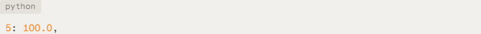

Maps the highest qualitative assessment 5 to a numeric score of 100.0,
representing the strongest possible qualitative contribution.​


Maps score 4 to 75.0, reflecting a strong but not top‑tier qualitative
assessment.​

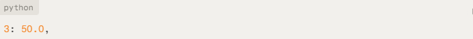

Maps neutral or mid‑range assessment 3 to 50.0, the midpoint of the
0–100 scale.​

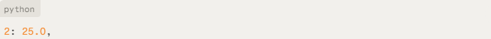

Maps score 2 to 25.0, indicating a weaker‑than‑average qualitative
assessment.​

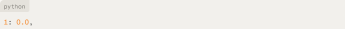

Maps the lowest qualitative assessment 1 to 0.0, representing the
weakest qualitative outcome.​

**Interpretation**

QUAL_SCORE_SCALE provides a **simple, transparent bridge** from ordinal
1–5 judgments to interval‑like 0–100 scores, ensuring qualitative
factors integrate cleanly into the weighted combined score alongside
quantitative metrics.​

**4. Helper functions**

The helper functions implement reusable building blocks for scoring
ratios, converting qualitative inputs, computing peer positioning, and
handling ratings and outlooks.

**4.1 score_ratio**

**Signature (code)**

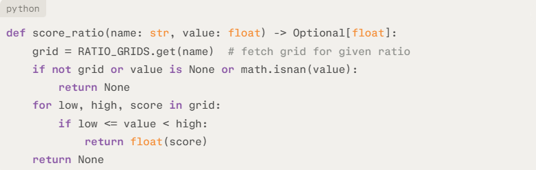

**Purpose**

Converts a raw ratio value into a 0–100 subscore by looking up the
corresponding piecewise grid in RATIO_GRIDS and identifying the interval
into which the value falls.​

**Behavior (line by line)**


Declares a function that takes:

- name: ratio identifier (e.g. "debt_ebitda").

- value: numeric ratio value to be scored.

Returns either a float subscore in the range 0–100 or None if the ratio
cannot be scored.


Retrieves the list of (low, high, score) bands for the specified ratio
name from RATIO_GRIDS.

If the ratio name is not configured, grid will be None.

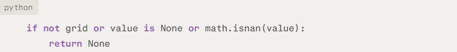

Handles missing configuration or invalid inputs:

- If grid is empty or None, there is no scoring grid for this ratio.

- If value is None or NaN, the ratio value is not usable.

In any of these cases, returns None to indicate that no numeric subscore
can be computed.

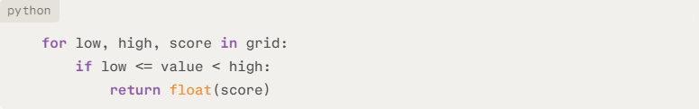

Iterates over each band (low, high, score) in the grid:

- Checks whether the value lies in the closed‑open
  interval $`\lbrack low,high)`$.

- On the first matching band, returns the associated score as a float.


- If no band matches the value (for example due to misconfigured
  intervals), returns None as a safeguard instead of raising an
  exception.​

**Interpretation**

score_ratio encapsulates the use of RATIO_GRIDS and provides a **single,
safe entry point** for converting heterogeneous ratios into standardized
subscores. Returning None for missing grids or invalid values allows
downstream logic in compute_quantitative to skip or log problematic
ratios without interrupting the rating process.

**4.2 score_qual_factor_numeric**

**Signature (code)**

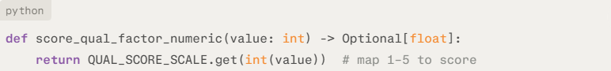

**Purpose**

Maps a qualitative assessment on a **1–5 scale** to the
corresponding **0–100 numeric subscore** using the
predefined QUAL_SCORE_SCALE mapping.​

**Behavior (line by line)**


Declares a function that accepts an integer value representing a
qualitative factor score (typically in the range 1–5).

Returns either a float between 0.0 and 100.0 or None if the input is
outside the defined mapping.


Casts value to int to ensure proper dictionary lookup.

Uses QUAL_SCORE_SCALE.get(...) to retrieve the corresponding numeric
score:

- 1 → 0.0, 2 → 25.0, 3 → 50.0, 4 → 75.0, 5 → 100.0.

If value is not in the mapping (e.g. 0 or 6), .get returns None.​

**Interpretation**

score_qual_factor_numeric provides a concise and explicit transformation
from a **Likert‑type 1–5 qualitative scale** to the 0–100 scale used in
the quantitative module, enabling qualitative and quantitative
components to be combined in a consistent numeric framework.​

**4.3 compute_altman_z_from_components**

**Signature (code)**

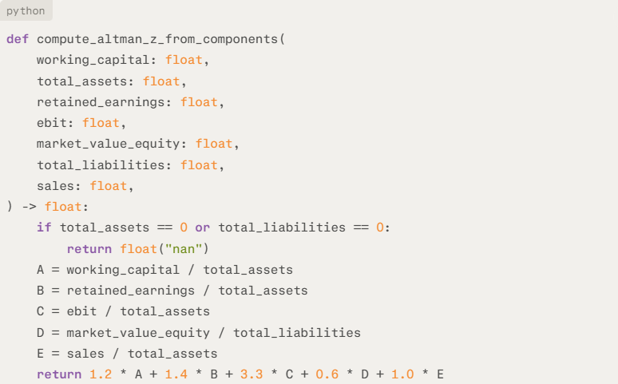

**Purpose**

Computes the classical **Altman Z‑score** for a firm using its balance
sheet and income statement components, returning NaN when key
denominators are zero to avoid invalid results.

**Behavior (line by line)**

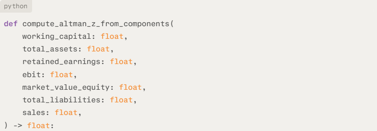

Declares a function that takes the component inputs needed for the
Altman Z formula:

- working_capital, total_assets, retained_earnings, ebit, market_value_equity, total_liabilities,
  and sales.

Returns a single float representing the Altman Z‑score.

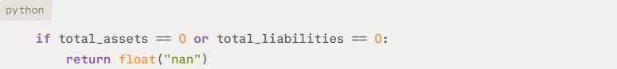

Guards against division by zero:

- If total_assets is zero, ratios with total_assets in the denominator
  cannot be computed meaningfully.

- If total_liabilities is zero, the market_value_equity /
  total_liabilities term is undefined.

In either case, returns NaN to signal an unusable Z‑score.

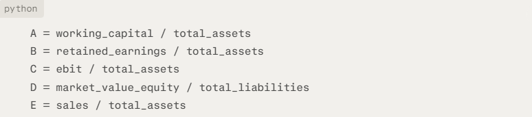

- Computes the five standard Altman ratios:

- $`A = \frac{\text{working\_capital}}{\text{total\_assets}}`$

- $`B = \frac{\text{retained\_earnings}}{\text{total\_assets}}`$

- $`C = \frac{\text{ebit}}{\text{total\_assets}}`$

- $`D = \frac{\text{market\_value\_equity}}{\text{total\_liabilities}}`$

- $`E = \frac{\text{sales}}{\text{total\_assets}}`$


Applies the original Altman Z‑score coefficients:

> 
> ``` math
> Z = 1.2A + 1.4B + 3.3C + 0.6D + 1.0E
> ```

Returns the resulting Z‑score as a float.​

**Interpretation**

compute_altman_z_from_components encapsulates the Altman Z formulation
so that the rating model can rely on a consistent, auditable calculation
of this distress indicator when only raw financial statement components
are available.

**\**

**4.4 compute_peer_score**

**Signature (code)**

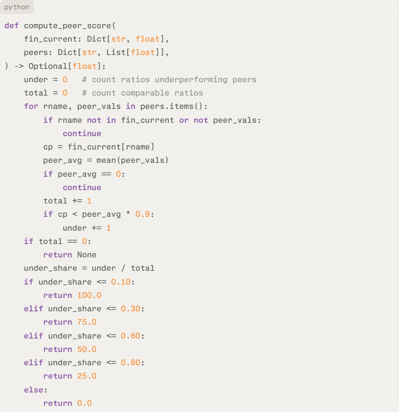

**Purpose**

Derives a **0–100 peer positioning score** by measuring how often the
firm’s ratios fall materially below peer averages, summarizing
cross‑sectional relative strength or weakness in a single metric.​

**Behavior (line by line)**

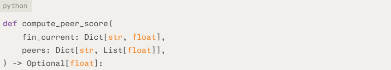

Declares a function that takes:

- fin_current: mapping of ratio name to the firm’s current ratio value.

- peers: mapping of ratio name to a list of peer values for that ratio.

Returns either a float peer score between 0.0 and 100.0 or None if no
comparable ratios are available.

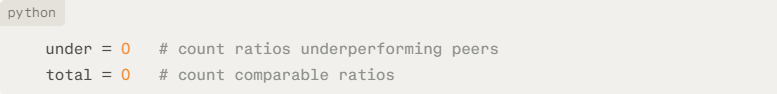

Initializes counters:

under: number of ratios where the firm significantly underperforms
peers.

total: number of ratios with valid comparisons.

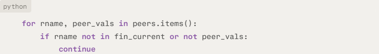

Iterates over each ratio and its peer values.

Skips the ratio if:

- The firm has no value for rname in fin_current.

- peer_vals is empty, making a comparison meaningless.


Retrieves the firm’s value cp for that ratio.

Computes peer_avg as the arithmetic mean of peer values.

Skips this ratio if peer_avg is zero to avoid degenerate relative
comparisons.​

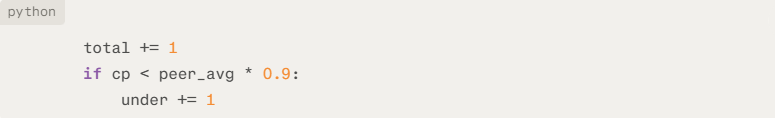

Increments total because this ratio has valid data for both the firm and
peers.

If the firm’s value is more than 10% below the peer average (cp \< 0.9
\* peer_avg), increments under, marking this ratio as a material
underperformance.

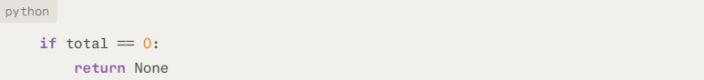

If no ratio yielded a valid comparison (total == 0), returns None to
indicate that no peer score can be computed.


Calculates the fraction of ratios where the firm materially
underperforms peers.

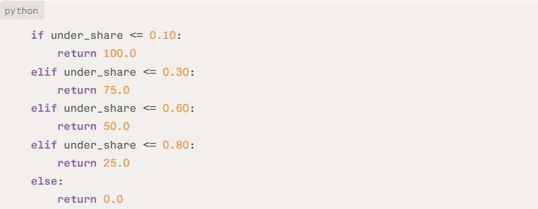

- Maps under_share to a discrete peer score:

  - ≤ 10% underperforming → 100.0 (strong vs peers).

  - ≤ 30% → 75.0.

  - ≤ 60% → 50.0.

  - ≤ 80% → 25.0.

  - 80% → 0.0 (broad underperformance).​

**Interpretation**

compute_peer_score compresses multi‑dimension peer comparisons into a
single **relative strength indicator**: a high score indicates that the
firm rarely falls significantly below peer norms across ratios, while a
low score signals widespread underperformance, which can then be
incorporated into the overall quantitative score and rating narrative.

**4.5 score_to_rating**

**Signature (code)**


**Purpose**

Maps a continuous **0–100 model score** to the corresponding **letter
rating grade** by applying the threshold table defined
in SCORE_TO_RATING.​

**Behavior (line by line)**


Declares a function that takes a numeric score (typically between 0 and
100) and returns the associated rating symbol as a string.

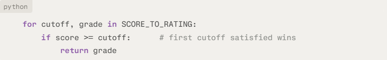

Iterates over the ordered list of (cutoff, grade) pairs
in SCORE_TO_RATING, from highest cutoff to lowest.

For each pair:

- Checks whether the score meets or exceeds the cutoff.

- Returns the corresponding grade for the **first** cutoff that is
  satisfied, implementing a step‑function mapping.


If no cutoff matches (for example, due to a misconfigured threshold
table or an out‑of‑range score), raises a ValueError with a diagnostic
message instead of silently assigning a default rating.​

**Interpretation**

score_to_rating provides a transparent, ordered implementation of the
score‑to‑grade mapping, ensuring that each numeric score is assigned to
exactly one rating band and that configuration errors surface clearly
during testing or logging.​

**4.6 safe_score_to_rating**

**Signature (code)**


**Purpose**

Provides a **robust wrapper** around score_to_rating that logs mapping
failures and returns a neutral "N/R" (“Not Rated”) label instead of
raising an exception.​

**Behavior (line by line)**


Declares a function that takes a numeric score and returns a rating
symbol as a string, with built‑in error handling.


Attempts to map the score to a rating by calling score_to_rating(score).

If the mapping succeeds, immediately returns the resulting grade.

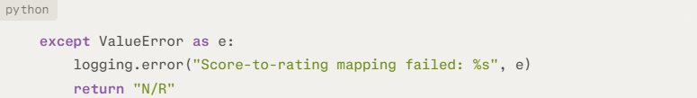

Catches any ValueError raised by score_to_rating (for example, when the
score does not fall into any configured band).

Logs an error message with details of the exception using the logging
framework.

Returns "N/R" to indicate that no valid rating could be determined for
this score.​

**Interpretation**

safe_score_to_rating separates **strict validation** in score_to_rating
from **fault‑tolerant behavior**, ensuring that unexpected score ranges
or configuration issues do not cause the rating engine to fail while
still leaving a clear trace in the logs.

**4.7 move_notches**

**Signature (code)**

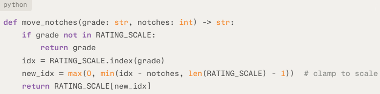

**Purpose**

Applies an **integer notch adjustment** to a rating grade by moving
along the ordered RATING_SCALE, with clamping at the best and worst
rating levels.

**Behavior (line by line)**


Declares a function that takes:

- grade: current rating symbol (e.g. "BBB").

- notches: integer number of notches to move (positive for downgrades,
  negative for upgrades in this implementation).

Returns the adjusted rating symbol as a string.


Checks whether grade is a valid entry in RATING_SCALE.

If not, returns the input grade unchanged as a defensive fallback.

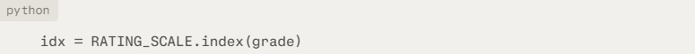

Finds the index idx of the current rating in RATING_SCALE, where lower
indices correspond to stronger credit quality.

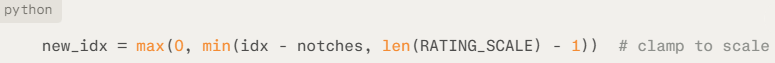

Computes the new index after applying the notch adjustment:

Given, Lower index = better rating:

- If notches = -2 (intended downgrade): new_idx = idx - (-2) = idx + 2 →
  moves **down** the scale → downgrade.

- If notches = +2 (intended upgrade): new_idx = idx – 2 → moves **up**
  the scale → upgrade.

Negative notches → downgrade.

Positive notches → upgrade.

Wraps the result in min(..., len(RATING_SCALE) - 1) and then max(0, ...)
to ensure the new index remains within the bounds of the rating scale
(no movement beyond "AAA" or "C").


Returns the rating symbol at the computed new_idx.​

**Interpretation**

move_notches provides a generic mechanism for implementing rating
transitions in discrete notches, and is used in particular to derive the
**hardstop rating** from the **base rating** by applying
distress_notches while respecting the model’s rating scale boundaries.

**4.8 apply_sovereign_cap**

**Signature (code)**

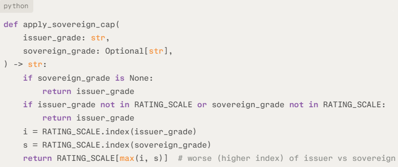

**Purpose**

Enforces a **sovereign ceiling** by ensuring the issuer’s rating cannot
be better than (i.e., lower index than) the sovereign rating on the
ordered RATING_SCALE.

**Behavior (line by line)**

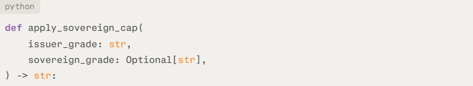

Declares a function taking the current issuer_grade and an
optional sovereign_grade, both as rating symbols.

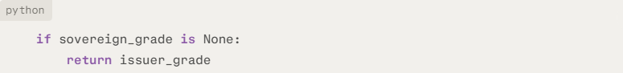

If no sovereign rating is supplied, returns the issuer rating unchanged
and **does not** apply any cap.

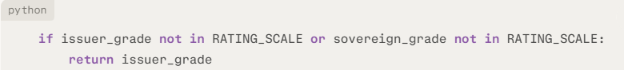

Validates that both grades are in RATING_SCALE; if either is invalid,
returns the issuer grade unchanged as a defensive safeguard.,

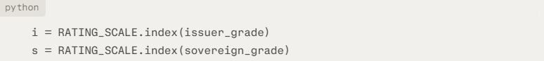

Looks up the ordinal positions of issuer and sovereign in the rating
scale, where index 0 is best (e.g."AAA") and higher indices are weaker
ratings.

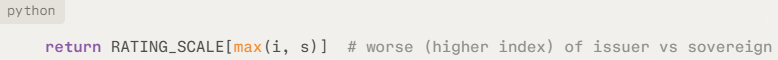

Returns the **worse** of the two ratings by taking the larger index
max(i, s), so the issuer can never be rated better than the sovereign.

**Interpretation**

apply_sovereign_cap provides a clean implementation of the classic
**sovereign ceiling** rule: in jurisdictions where sovereign risk
constrains issuers, the final rating is mechanically capped at the
sovereign level while remaining unchanged when already at or below it.

**\**

**4.9 compute_effective_weights**

**Signature (code)**

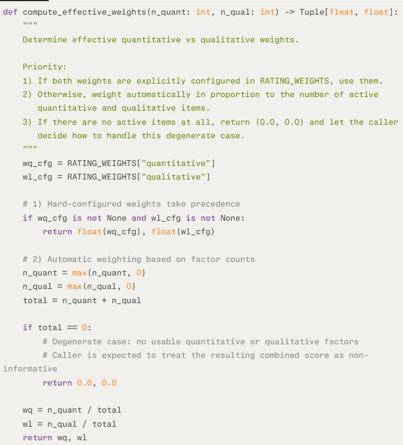

**Purpose**

Determine the effective weight split between the quantitative and
qualitative modules, either from explicit configuration (RATING_WEIGHTS)
or, if not set, from the relative number of active factors in each
module.​

Ensure the combined score reflects the information content of each side
(more active items → higher weight), while allowing hard‑coded weights
when required by policy or calibration.

**Behavior (line by line)**

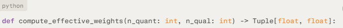

Takes the counts of usable quantitative (n_quant) and qualitative
(n_qual) items and returns a pair of floats (wq, wl) representing their
effective weights in the combined score.

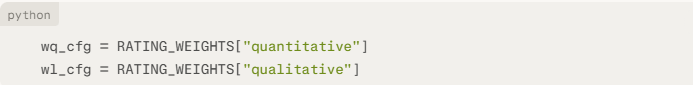

Loads any **configured** quantitative and qualitative weights
from RATING_WEIGHTS, which act as policy overrides when both are set.

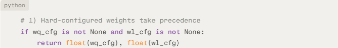

If both weights are present, returns them directly as floats, bypassing
automatic logic; this lets you fix the quant/qual split independently of
factor counts.

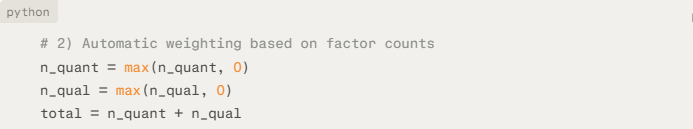

Floors n_quant and n_qual at zero to avoid negative values, then
computes total as the sum of active quant and qual items for
proportional weighting.

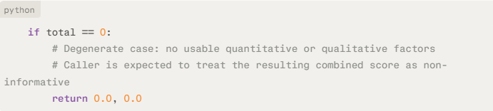

If there are **no active factors at all**, returns (0.0, 0.0) to signal
that neither side carries information; downstream code should treat any
combined score from these weights as non‑informative and handle or flag
the situation.


When at least one side has active factors, assigns weights in proportion
to **relative item counts** (more factors → higher weight) and
returns (wq, wl) for use in the combined score.

**4.10 get_rating_band**

**Signature (code)**


**Purpose**

Derives the **inclusive numeric score interval**
$`\left\lbrack \text{min},\text{max} \right\rbrack`$ that maps to a
given rating symbol, using the ordered SCORE_TO_RATING threshold table.

**Behavior (line by line)**


Iterates over SCORE_TO_RATING (ordered from highest to lowest cutoff),
tracking index i and unpacking each (cutoff, grade) pair.

Looks for the entry whose grade matches the requested rating.


Sets the **lower bound** of the band to that rating’s cutoff, consistent
with the score‑to‑rating mapping logic.


For the top rating (index 0, e.g. "AAA"), sets the **upper bound** to
100.0, so this band is \[cutoff, 100\].


For all other ratings, uses the **previous** rating’s cutoff minus 1 as
the upper bound, creating adjacent, non‑overlapping integer bands
(e.g. AA might be \[90, 94\] if AAA starts at 95).


Returns the computed (band_min, band_max) tuple as floats.


If no matching grade is found in SCORE_TO_RATING, raises a ValueError,
surfacing configuration issues or typos in the rating symbol.​

**Interpretation**

get_rating_band implements the inverse of score_to_rating, allowing the
model to recover the **score band** corresponding to an assigned rating,
which is then used, for example, to position the combined score within
its band when deriving rating outlooks.

**4.11 derive_outlook_band_only**

**Signature (code)**


**Purpose**

Derives a **band-based outlook** ("Positive", "Stable", or "Negative")
by positioning the floored combined_score within the numeric score band
associated with the current rating.

**Behavior (line by line)**


Retrieves the inclusive lower and upper bounds of the score band that
maps to the given rating using get_rating_band.


Floors the combined score to an integer, ensuring outlook decisions
depend on whole‑score positioning within the band.


If the floored score sits at the **top** of the band, assigns
a "Positive" outlook, signaling upward pressure within the current
rating.


If it sits at the **bottom** of the band, assigns a "Negative" outlook,
signaling downward pressure.


Otherwise, returns "Stable", indicating mid‑band positioning without
clear directional pressure.

**Interpretation**

derive_outlook_band_only provides a simple, deterministic rule to
translate where the score lies **within** its rating band into an
outlook, which can then be further refined by distress‑trend logic in
the broader model.

**4.12 derive_outlook_with_distress_trend**

**Signature (code)**


**Purpose**

derive_outlook_with_distress_trend refines a base_outlook when distress
hardstops are active by looking at trends in key distress ratios
(interest_coverage, dscr, altman_z) between two periods and biasing the
outlook toward "Negative" for clear deterioration or
toward "Stable" when distress metrics are non‑worsening.

It ensures that, once distress has already pulled the rating down, the
outlook still reflects whether distress indicators are getting better,
worse, or staying broadly unchanged.

**Behavior line by line**


Declares a function that takes the current outlook, total
distress‑driven notch adjustment, and two period‑end financial ratio
snapshots, and returns an adjusted outlook string.


If there is no negative distress adjustment (no effective hardstop) it
returns base_outlook unchanged; trend logic is only relevant when
distress has actually pulled the rating down.


Defines the three distress indicators to check and initializes flags to
track whether, overall, they show improvement or deterioration.


Iterates over each distress ratio, fetching current (v0, at t0) and
prior (v1, at t1) values; if either is missing, that ratio is skipped
from the trend analysis.


Treats higher values as better for all three indicators.​

If the ratio has increased (v0 \> v1), it flags improving = True; if it
has decreased (v0 \< v1), it flags deteriorating = True.


If at least one ratio has improved and none have worsened, it
returns "Stable", signalling that distress is still present but trending
non‑worsening or improving.


If at least one ratio has worsened and none have improved, it
returns "Negative", signalling clear downside risk within an
already‑distressed situation.


In all other cases (mixed signals, flat ratios, or no usable data), it
defaults to "Stable", avoiding overreaction to noisy or conflicting
trends.

**Interpretation**

This function overlays a **trend‑sensitive layer** on top of the base
outlook when distress notches are active: improving distress metrics
prevent an outright Negative outlook, while unambiguously worsening
metrics force a Negative outlook; otherwise, the model stays with Stable
under distress.

5.  **Data classes**

**5.1 QuantInputs**

**Signature (code)**


**Purpose**

Groups all quantitative inputs for the rating model—multi‑period
financial ratios, statement components, and peer data—into a single
structured container, so that quantitative computations can consume one
object instead of many separate dictionaries.

Supports level and trend analysis over three periods and peer
benchmarking at the current period, aligning with typical rating
practices.

**Behavior (field by field)**


Holds current‑period financial ratios (e.g. leverage, coverage,
profitability, liquidity, Altman Z) that form the primary basis for
quantitative scoring and distress checks.


Stores prior‑period ratios, enabling simple two‑point trend analysis
such as comparing distress indicators between t0 and t1 in the
outlook-with-trend logic.


Provides ratios from two periods ago, completing a three‑year history
that can support deeper level and trend analysis in the quantitative
module or future extensions.


Contains current‑period financial statement components (working capital,
total assets, retained earnings, EBIT, market value of equity, total
liabilities, sales) used to compute Altman Z and other derived metrics
when not already present in fin_t0.


Captures prior‑period components, allowing derived ratios
at $`t_{1}`$ (including the Altman Z‑score) to be recomputed later for
analysis and diagnostics.


Stores components two periods ago, extending the component history to
three years in line with the ratio history and Altman‑style time‑series
use.


Maps each ratio name to a list of peer‑group values at t0, providing the
input for compute_peer_score to derive a 0–100 peer positioning score
that complements the issuer’s standalone metrics.

**Interpretation**

QuantInputs acts as the **canonical container** for all numeric building
blocks of the quantitative engine—current and historical ratios,
underlying components, and peer benchmarks—making the rating workflow
easier to call, test, and audit while keeping time‑series and peer
dimensions explicit.

**5.2 QualInputs**

**Signature (code)**


**Purpose**

Encapsulates the qualitative assessment inputs for the rating model as
simple 1–5 scores across factors such as management quality, industry
risk, governance, and financial policy for two periods.​

Provides a structured source for converting qualitative judgments into
0–100 subscores and for comparing qualitative profiles over time.​

**Behavior (field by field)**


Stores current‑period qualitative factor scores as integers from 1 to 5,
which compute_qualitative converts to 0–100 using QUAL_SCORE_SCALE to
produce the qualitative module score.


Holds prior‑period qualitative factor scores (same factor names where
available), enabling detection of changes in perceived business risk,
management, or other soft factors between t1 and t0 if needed.​

**Interpretation**

QualInputs provides a compact, typed container for the
model’s **soft‑factor** view, separating 1–5 expert judgments from the
numeric 0–100 scale while keeping current and previous qualitative
profiles available for scoring and potential trend analysis.

**5.3 RatingOutputs**

**Signature (code)**


**Purpose**

Collects all key outputs of the rating engine—scores, ratings at each
stage, caps, outlook, diagnostics, and narrative—into a single
structured object suitable for reporting, APIs, and audit trails.​

Makes the full decision path from raw scores to final rating and outlook
transparent and machine‑readable.​

**Behavior (field by field)**


Identifies the rated counterparty, used for labelling logs, reports, and
any downstream storage.


Stores the 0–100 score from the quantitative module (ratios, Altman Z,
peer score), typically the numeric anchor of the rating.​


Contains the 0–100 score from qualitative factors after mapping 1–5
inputs via the qualitative score scale.


Holds the final weighted 0–100 score after applying effective
quantitative vs qualitative weights, before mapping to a rating.


Records the 0–100 peer positioning score, if computed, summarising how
the issuer compares to its peers.


Letter rating implied directly by combined_score via score_to_rating,
before distress hardstops or sovereign cap adjustments.


Total number of notches (typically negative) applied due to distress
indicators such as interest coverage, DSCR, and Altman Z.


Rating obtained by
applying distress_notches to base_rating using move_notches,
representing the distress‑capped rating before any sovereign ceiling.


Rating after enforcing the sovereign cap with apply_sovereign_cap, i.e.
constrained not to exceed the sovereign rating when that logic is
enabled.


Delivered letter rating; currently equal to capped_rating, but kept as a
separate field for potential future overrides or policy adjustments.


Flag indicating whether distress hardstop logic actually affected the
rating (i.e. whether distress_notches was non‑zero).


Captures which distress metrics contributed to the hardstop and their
values (e.g. specific interest coverage, DSCR, Altman Z at t0) for
explanation and audit.


The sovereign rating used for the cap, if provided, giving context for
any ceiling applied to the issuer.


The sovereign outlook (e.g. Positive/Stable/Negative), which may be
inherited by the issuer when the sovereign cap is binding.


Indicates whether the sovereign cap is binding in practice (issuer’s
final rating is constrained to the sovereign level).


Issuer outlook (Positive/Stable/Negative) after combining band‑based
logic and distress‑trend adjustments, and after any sovereign‑binding
effects.


Average quantitative scores by ratio family (e.g. leverage, coverage,
profit, other, altman), used for diagnostics and explanatory commentary.


Latest Altman Z‑score at t0, often cited explicitly in rationales
related to financial distress.


Generic boolean flags for key conditions (e.g. data gaps, peer weakness,
configuration issues) to support governance and exception handling.


Human‑readable narrative summarising why the rating and outlook were
assigned, including anchor score, distress effects, sovereign cap, and
key strengths/weaknesses.

**Interpretation**

RatingOutputs is the **authoritative record** of a model run, capturing
not just the final rating but also intermediate stages, drivers, and
narrative, which is critical for transparency, auditability, and
integration into reporting or workflow systems.

6.  **Model**

**6.1 RatingModel**

**Signature (code)**


**Purpose**

Defines the rating engine as an object, with cp_name storing the issuer
identifier so that all downstream calculations, logs, and outputs can be
clearly tied to a specific counterparty.​

Provides a natural place to attach methods that run the full workflow
(quantitative scoring, qualitative scoring, distress hardstops,
sovereign cap, and final rating/output construction).

**Behavior (line by line)**


Declares the main model class that will encapsulate the end‑to‑end
credit rating logic.​


Defines the constructor, taking cp_name (counterparty name or
identifier) as a required argument.


Stores the provided counterparty name on the instance so it can be used
in logging messages and copied into RatingOutputs.issuer_name when a
rating run is executed.​

**Interpretation**

RatingModel is the **shell object** around which the full rating
workflow is organised: it binds a specific issuer name to the model
instance and is the natural home for methods like compute_quantitative,
compute_qualitative, compute_distress_notches, and compute_final_rating
that operate on that issuer.

**6.2 \_ensure_altman_z**

**Signature (code)**


**Purpose**

Guarantees that a current‑period Altman Z‑score is available in
the fin ratios dictionary, computing it from raw statement components if
missing and caching the result for downstream use.​

Centralises Altman Z derivation so other parts of the model can rely
on fin\["altman_z"\] being present without duplicating computation
logic.​

**Behavior (line by line)**


Defines a helper method on RatingModel that takes the current
ratios (fin) and components (comps), and returns a float Altman Z‑score.


Comment clarifying that the function only computes Altman Z when it is
not already available in fin.


If fin already contains a non‑None altman_z value, returns it
immediately, avoiding recomputation and preserving any pre‑calculated
ratio.


Otherwise, calls compute_altman_z_from_components with the seven
required inputs from comps (working capital, total assets, retained
earnings, EBIT, market value of equity, total liabilities, sales) to
compute the standard Altman Z‑score.


Writes the computed Z‑score back into the fin dictionary under
the "altman_z" key, caching it for subsequent use in distress logic and
reporting.


Logs an informational message including the counterparty name
(self.cp_name) and the computed Z‑score to three decimal places,
providing traceability of the derived metric.


Returns the Altman Z‑score so callers can use it directly in their
logic.​

**Interpretation**

\_ensure_altman_z is a small but important **plumbing helper**: it
bridges raw statement components and the Altman Z ratio, ensuring the
model always has a usable Z‑score while avoiding redundant computations
and providing an audit trail via logging.

**6.3 compute_quantitative**

**Signature (code)**


**Purpose**

Computes the overall quantitative module output: the aggregate 0–100
quantitative score, peer positioning score, per‑bucket averages, Altman
Z, and the count of quantitative items used.​

It is the central engine that transforms raw ratios and peer data into
the numeric quantitative anchor and diagnostics for the rating.​

**Behavior (line by line)**


Defines a method on RatingModel that takes QuantInputs and returns a
tuple of quantitative_score, peer_score, bucket_avgs, altman_z, and the
number of quantitative items.​


Copies the current‑period ratios into a local fin dict so that any
augmentation (e.g. adding altman_z) does not modify the
original QuantInputs.​


Ensures fin contains an altman_z value by computing it
from components_t0 if necessary, and stores/returns the resulting
Z‑score.​


Initialises a list to collect all quantitative subscores (ratio scores
plus potentially peer score) on a 0–100 scale.​


Sets up buckets by ratio family (leverage, coverage, profitability,
etc.) to accumulate subscores for later per‑family averaging.​


Initialises a counter for how many quantitative items (including peer
score, if any) are effectively used in the module.​


Iterates over each ratio name and value in the current‑period ratios
dictionary.​


Skips ratios that are not mapped to a family in RATIO_FAMILY, ensuring
only recognised analytical ratios are scored.​


Calls score_ratio to translate the raw ratio value into a 0–100 subscore
using the appropriate ratio grid.​


If no score can be computed (missing grid or out‑of‑band), logs this
fact and skips the ratio rather than forcing a default.​


Adds the valid subscore to the list of scores and increments the
quantitative item counter.​


Looks up the ratio family and appends the subscore to that family’s
bucket to support later bucket‑level diagnostics.​


Logs the ratio name, raw value, score, and family for traceability of
the quantitative scoring process.​


Computes an optional 0–100 peer positioning score by
comparing fin ratios to peer distributions from peers_t0.​


If a peer score is available, includes it as an additional quantitative
item, assigns it to the other bucket, and logs the result.​


Computes the aggregate quantitative score as the simple arithmetic mean
of all collected subscores, defaulting to 0.0 if no scores were
produced.​


Logs the final quantitative aggregate score for the issuer.​


Builds a dictionary of per‑bucket averages, rounded to one decimal
place, defaulting empty buckets to 0.0 to keep the structure complete.​


Returns the overall quantitative score, peer score, bucket averages,
Altman Z at t0, and the count of quantitative items used, which feed
into later stages (weighting, explanations, outputs).​

**Interpretation**

compute_quantitative is the core quantitative engine: it consolidates
ratio grids, distress‑relevant Altman Z, and peer comparisons into a
single numeric anchor plus rich diagnostics, forming the quantitative
backbone of the final rating.

**6.4 compute_qualitative**

**Signature (code)**


**Purpose**

Transforms current‑period qualitative 1–5 factor assessments into a
single 0–100 qualitative score and counts how many factors were actually
usable.​

Provides the qualitative module result and factor count needed for
weighting against the quantitative score in the overall rating.​

**Behavior (line by line)**


Defines a method that takes QualInputs and returns a tuple of
qualitative_score and the number of qualitative items used.​


Initialises a list to collect 0–100 qualitative subscores and a counter
for how many qualitative factors are valid.​


Iterates over each qualitative factor name and its 1–5 value for the
current period.​


Maps the raw 1–5 value to a 0–100 score
using score_qual_factor_numeric (based on QUAL_SCORE_SCALE).​


If the factor value is outside the defined range or otherwise unmapped,
logs an informational message and skips this factor.​


Adds the valid qualitative subscore to the list and increments the count
of usable qualitative items.​


Logs the factor name, raw 1–5 value, and derived 0–100 score for
traceability.​


Computes the qualitative module score as the simple average of all valid
qualitative subscores, defaulting to 0.0 when no valid factors are
present.​


Logs the aggregate qualitative score for the issuer.​


Returns the qualitative score and the number of qualitative items used,
both needed later for effective weight computation and reporting.​

**Interpretation**

compute_qualitative is the **qualitative counterpart** to the
quantitative engine: it converts 1–5 expert judgments into a transparent
0–100 score, logs each step, and exposes how many soft‑factor inputs
actually influenced the overall rating.

**\**

**6.5 compute_distress_notches**

**Signature (code)**


**Purpose**

Calculates the total **distress‑driven notch adjustment** to the rating
and records which distress indicators (interest coverage, DSCR, Altman
Z) triggered it.​

Implements a mechanical hard‑stop: weak distress metrics force
additional negative notches, subject to a lower bound on how far the
rating can be pulled down by distress.​

**Behavior (line by line)**


Defines a method that takes the current‑period ratios fin and an Altman
Z‑score, returning the total distress notches and a details dictionary.​


Initialises the cumulative notch adjustment at zero and an empty mapping
to hold the distress metrics that actually contributed.​


Looks up interest coverage and, if present, walks its distress bands
from most to least severe; on the first threshold that ic breaches, adds
the associated negative notches, records the ic value in details, and
stops checking further bands.​


Does the same for DSCR: if present and below a configured threshold,
adds the corresponding notches and records the DSCR value as a distress
driver.​


Always evaluates Altman Z against its distress bands; on the first
threshold that Z breaches, adds those notches and records the Altman Z
value in details.​


Applies a floor to the total adjustment: if the summed notches are more
negative than the allowed maximum (e.g. below −4), clamps them
at MAX_DISTRESS_NOTCHES to avoid excessive distress‑driven downgrades.​


Returns the final notch adjustment (typically zero or negative) together
with the dictionary of distress metrics that triggered it, enabling both
mechanical rating moves and transparent explanations.​

**Interpretation**

compute_distress_notches encodes the model’s **hard‑stop logic**: key
coverage and solvency indicators directly cap how strong a rating can
be, while the details output makes the distress rationale explicit for
governance and reporting.

**6.6 compute_final_rating**


**Signature (code)**


**Parameters**

- quant_inputs: QuantInputs with current and historical ratios,
  components, and peer data used for the quantitative module.​

- qual_inputs: QualInputs with current and prior qualitative 1–5 factor
  scores.​

- sovereign_rating: Optional sovereign rating used as a ceiling when the
  sovereign cap is enabled.​

- sovereign_outlook: Optional sovereign Positive/Stable/Negative
  outlook, used when the cap is binding to shape the issuer’s outlook.​

- enable_hardstops: Whether to apply distress‑based hardstops
  (compute_distress_notches); default False means distress logic is
  configured but inactive.​

- enable_sovereign_cap: Whether to enforce the sovereign ceiling
  via apply_sovereign_cap; default False means the sovereign
  rating/outlook are informational only.

**Purpose**

Runs the **full rating pipeline** end‑to‑end for one issuer: computes
quantitative and qualitative scores, applies effective weights, derives
a base rating, and then optionally applies distress hardstops and an
optional sovereign cap (both switches are **off by default**),
determines the outlook, and packages everything into
a RatingOutputs object with explanation.​

By default, the function behaves as a pure, uncapped base rating engine;
only when the caller explicitly
sets enable_hardstops=True or enable_sovereign_cap=True do hardstops or
the sovereign ceiling mechanically constrain the rating.

**Behavior (step by step, in order)**

1.  Quantitative and qualitative scores


Calls the quantitative and qualitative engines to obtain their
respective 0–100 scores, diagnostics, Altman Z, and counts of active
factors.​

2.  Effective weights and combined score


Determines the effective quantitative and qualitative weights, using
configured weights if present or falling back to factor‑count‑based
weights.​


Logs the factor counts and resulting weights for transparency.​


Forms the combined 0–100 score as a weighted average of quantitative and
qualitative scores.​

3.  Base rating (pre‑hardstops / cap)


Maps combined_score to a letter grade using the score‑to‑rating table,
with a safe wrapper that returns "N/R" instead of raising on
configuration issues.​

4.  Hardstops / distress notches


If hardstops are enabled, computes the total distress‑driven notch
adjustment and records which metrics triggered it; otherwise, sets no
adjustment and empty details.​


Applies distress_notches to the base rating along the rating scale,
producing the post‑distress hardstop rating.​


Flags whether distress actually pulled the rating down.​

5.  Sovereign cap


Starts from the hardstop rating and, if the sovereign cap is enabled
with a valid sovereign rating, caps the issuer rating so it cannot
exceed the sovereign.​


Sets the final rating equal to the capped rating (no extra override
layer yet).​

6.  Sovereign cap binding flag


Defines whether the sovereign cap is binding in practice (issuer ends up
at the sovereign level under an active cap).​

7.  Outlook logic


Computes **base_outlook** (Positive/Stable/Negative) only from
where combined_score sits inside
the **band** for base_rating.

Enters the **sovereign-binding branch** only if the sovereign cap is
actually binding and the sovereign outlook is one of the three valid
values.​


Checks the **special aligned case**:

- The issuer’s **rating after hardstops**, the **capped rating**, and
  the **sovereign rating** are all the same (fully aligned at the
  sovereign level).​

- The model’s band-based **base_outlook** equals
  the **sovereign_outlook**.

If both hold, it sets outlook to base_outlook, i.e. it **does not add
extra conservatism**; the issuer just keeps the model’s own band-based
view, which is already equal to the sovereign.


For all other binding cases, first checks if the model is **more
optimistic** than the sovereign: base_outlook == "Positive" while
sovereign is only Stable or Negative.​

If so, it **forces the outlook to the sovereign_outlook** (Stable or
Negative), so the issuer cannot have a more positive outlook than the
sovereign when capped.


If either the base outlook or the sovereign outlook is **Negative**, it
sets the issuer outlook to **"Negative"**.​

This is a **conservative tie‑break**: any Negative on either side drives
a Negative issuer outlook.


This branch handles the remaining binding combinations:

- Neither side is Negative.

- The model is not strictly more optimistic than the sovereign (the
  earlier if already captured Positive vs Stable/Negative).​

In that situation it sets outlook to **"Stable"**, reflecting a
neutral/non‑directional view under a binding cap.


This ‘else’ fires when **sovereign_cap_binding is False** or the
sovereign outlook is missing/invalid.​

It calls derive_outlook_with_distress_trend to potentially **overlay
distress trends** onto the band-based base_outlook.​

Inside that helper:

- If distress_notches \< 0 (a distress hard‑stop has actually pulled the
  rating down), it may change the outlook based on how interest
  coverage, DSCR and Altman Z moved between t1 and t0 (worsening →
  Negative, improving/non‑worsening → typically Stable).​

- If distress_notches == 0 (no distress hard‑stop), it
  simply **returns base_outlook unchanged**, the pure band-based
  outlook.


As a last step, checks if the **final rating is AAA** and the
computed outlook is **Positive**.​

If so, it normalises the outlook to **"Stable"**, enforcing the policy
that AAA should not carry a Positive outlook.

8.  Flags


Builds a flags dictionary capturing which policy switches are active and
whether hardstops and sovereign cap actually constrain the rating.​

9.  Rating explanation


Starts a list of text fragments that will be concatenated into a
narrative explanation.​

Core model sentence:


Explains the combined score and corresponding base rating.​

Distress / hardstops:


Adds a clause describing whether and how distress hardstops affected the
rating.​

Sovereign cap:


If a sovereign context is present, appends explanation depending on
whether the cap binds and how.​

Binding and worsening vs hardstop:


Binding but aligned:


Not binding:


No cap applied:


Final sentence:


Summarises the final rating and outlook.​


Concatenates all fragments into a single explanation string.​

Logging and return


Logs the key rating stages, outlook, and distress notches for the
issuer.​


Constructs and returns a fully populated RatingOutputs instance
containing all scores, ratings at each stage, outlook, diagnostics,
flags, and narrative.​

**Interpretation**

compute_final_rating is the **master coordinator** of the model: it ties
together quantitative and qualitative modules, policy controls
(hardstops and sovereign cap), outlook mechanics, and explanation
building into a single, auditable rating decision for each issuer.​

7.  **Sample data and run**

**7.1 Script entry point and logging**

**Signature (code)**


**Purpose**

Marks the block as executable only when the module is run as a script,
and configures logging to show informational messages for the sample
run.​

**Behavior**

- if \_\_name\_\_ == "\_\_main\_\_": ensures the sample data
  construction and model run execute only in direct script runs, not
  when the module is imported.​

- logging.basicConfig(level=logging.INFO) sets the logging level so
  all INFO messages from the rating workflow are emitted to stdout.​

**7.2 Sample quantitative inputs**

**Signature (code)**


**Purpose**

Provide a three‑year history of financial ratios covering leverage,
coverage, profitability, liquidity, and capex metrics, used to
illustrate the model’s quantitative scoring and distress logic.​

**Behavior**

fin_t0 holds current‑period ratios
(e.g. debt_ebitda, interest_coverage, dscr, margins, returns, liquidity)
representing the primary level snapshot.​

fin_t1 and fin_t2 hold prior‑period values of the same ratios, creating
a mildly improving/historic trajectory for coverage and profitability
while leverage gradually increases.

**Signature (code)**


**Purpose**

Define three years of financial statement components required to compute
Altman Z‑scores and potentially other derived ratios.​

**Behavior**

Each dictionary includes working_capital, total_assets,
retained_earnings, ebit, market_value_equity, total_liabilities, and
sales, with moderate growth over time to resemble a realistic corporate
trajectory.

**Signature (code)**


**Purpose**

Supply peer‑group ratio data at t0 for each ratio in fin_t0, enabling
the computation of a peer positioning score.

**Behavior**

Maps each ratio name to a list of three peer values, generally slightly
stronger than the issuer, so the sample will show some underperformance
vs peers.

**Signature (code)**


**Purpose**

Bundle the three‑year ratios, components, and peer data into a
single QuantInputs instance suitable for compute_quantitative.

**Behavior**

Creates a structured container that the model uses to derive
quantitative scores, Altman Z, bucket averages, and peer positioning.

**7.3 Sample qualitative inputs**

**Signature (code)**


**Purpose**

Define a realistic grid of qualitative 1–5 scores (industry risk, market
position, management, governance, policy, liquidity, etc.) for two
periods, then bundle them into QualInputs.

**Behavior**

qual_t0 encodes generally mid‑to‑strong qualitative assessments (3–5
range), typical for a solid but not top‑tier issuer.

qual_t1 = qual_t0.copy() implies no qualitative trend, keeping the
example focused on quantitative and distress aspects.

qual_inputs packages these into the format compute_qualitative expects.

**7.4 Sovereign context and model run**

**Signature (code)**


**Purpose**

Provide a sample sovereign rating and outlook to exercise the sovereign
cap and sovereign‑aligned outlook logic.

**Signature (code)**


**Purpose**

Instantiate the rating model for issuer "SampleCorp" and run the full
rating pipeline on the sample inputs with sovereign cap enabled and
hardstops disabled. The user can enable or disable the sovereign_cap and
enable_hardstops by inputting True or False values.

**Behavior**

RatingModel(cp_name="SampleCorp") binds the model instance to the issuer
name used in logs and outputs.

compute_final_rating(...) produces a RatingOutputs object, applying
weights, mapping to a base rating, enforcing the sovereign cap, deriving
outlook, and building a narrative explanation.

**7.5 Summary construction and printing**

**Signature (code)**


**Purpose**

Extract key fields from RatingOutputs, round some scores for
readability, and print a concise textual summary of the sample rating
run.

**Behavior**

Builds a summary dictionary containing all core outputs: scores,
ratings, outlook, flags, bucket averages, Altman Z, and the explanation
string.

Iterates through summary and prints each key–value pair, providing a
quick, human‑readable report of the model outcome for "SampleCorp".

**Interpretation**

This sample block demonstrates end‑to‑end usage of the rating engine: it
shows how to construct realistic quantitative and qualitative inputs,
supply sovereign context, run compute_final_rating, and consume the
resulting RatingOutputs for reporting or debugging.
